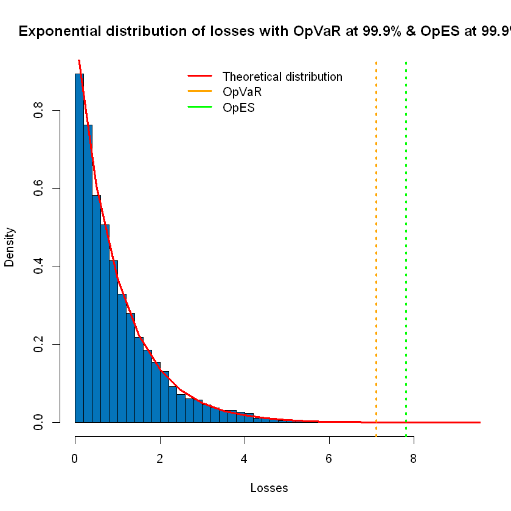

# Models in credit and operational risk
## Description
This project and exercises were made for the Models in credit and operational risk course at the AGH UST in 2022.
All provided methods are a result of my work after hours, when I was solving given tasks (topics).

## Topics
**Project Credit scoring methods**

This project aims to introduce the reader to the scoring methods in credit risk by presenting the substantive content 
supported by examples. For this reason, the first part of the work focuses on discussing the theoretical aspects of scoring. 
The next stage is the preparation and analysis of the selected data set, which will be used to demonstrate the operation of selected scoring methods:

- KNN
- Logistic Regression
- Random Forest
- Decission Tree
- SVM

Ultimately, the project provides for an evaluation of the results completed with a summary. The project is implemented using the Python language in Jupyter Notebook.

**Laboratory 1**

- LDA
- Altman Z-score

**Laboratory 2**

- Basel I
- Basel II

**Laboratory 3**

- Naive Bayes
- Logistic Regression
- LDA

**Laboratory 4**

- LDA
-  OpVaR and OpES using the Monte Carlo method

## Technology stack

- Python
- R programming language
- Jupyter Notebook

## Data Source
- Kaggle: Your Machine Learning and Data Science Community https://www.kaggle.com/datasets/dansbecker/aer-credit-card-data
